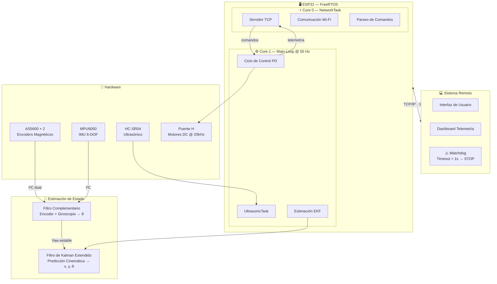
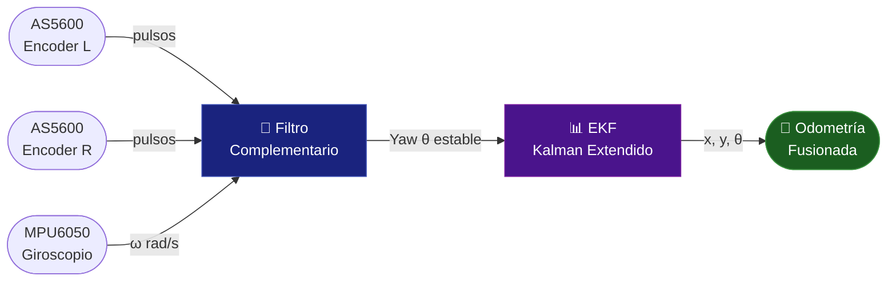

<div align="center">

# 🤖 NovaStep

### Plataforma de Robótica Móvil con Estimación de Estado y Control Distribuido


</div>

---

## 🚀 Descripción del Proyecto

**NovaBot** es un robot diferencial avanzado que integra técnicas de **Sensor Fusion** y **Sistemas de Tiempo Real (RTOS)** para lograr una navegación precisa.

El sistema separa las tareas críticas en el microcontrolador **ESP32**:

| Capa | Responsabilidad | Tecnología |
|------|----------------|------------|
| 🔴 **Firmware** | Control de motores y lectura de sensores | ESP32 + FreeRTOS |
| 🔵 **Estimación** | Fusión de sensores y odometría | EKF + Filtro Complementario |
| 🟢 **Comunicación** | Interfaz de usuario y telemetría remota | TCP/IP Wi-Fi |

---

## 🛠️ Arquitectura de Software



---

## 📐 Pipeline de Estimación de Estado



---

## ⚙️ Control de Movimiento

```
┌─────────────────────────────────────────────────────┐
│                  Loop de Control @ 50 Hz            │
│                                                     │
│   Referencia ──► [PD Controller] ──► PWM ──► Motor │
│       ▲                                    │        │
│       └────────── [Encoder AS5600] ◄───────┘        │
│                                                     │
│   ⚠️  Zona Muerta: compensación de fricción estática │
│   🛡️  Watchdog: detención automática si timeout >1s  │
└─────────────────────────────────────────────────────┘
```

| Módulo | Descripción |
|--------|------------|
| **Control PD de Velocidad** | Controlador P-D independiente por rueda. Ajusta el PWM para igualar la velocidad medida por los encoders con la referencia del usuario |
| **Manejo de Zona Muerta** | Compensación de fricción estática para movimientos suaves a baja velocidad |
| **Software Watchdog** | Detiene el robot automáticamente ante pérdida de conexión mayor a **1 segundo** |

---

## 📡 Protocolo de Telemetría

El robot emite un frame de datos cada **100 ms** con el estado completo del sistema:

```
┌──────────────────────────────────────────────────────────────┐
│  NOVASTEP TELEMETRY FRAME · 10 Hz                           │
├─────────────────┬────────────────────────────────────────────┤
│  POS_X / POS_Y  │  Posición estimada (Odometría pura vs EKF) │
│  THETA          │  Orientación fusionada                     │
│  ROLL / PITCH   │  Inclinación absoluta IMU                  │
│  YAW            │  Rotación absoluta fusionada               │
│  US_DIST        │  Distancia a obstáculos (filtrada)         │
│  CMD_L / CMD_R  │  Comandos enviados vs. PWM aplicado        │
└─────────────────┴────────────────────────────────────────────┘
```

---

## 🔌 Hardware

| Componente | Modelo | Interfaz | Notas |
|------------|--------|----------|-------|
| **Encoders** | AS5600 × 2 | Dual I²C (`Wire` + `Wire1`) | Evita colisión de direcciones |
| **IMU** | MPU6050 | I²C | Giroscopio + Acelerómetro 6-DOF |
| **Ultrasónico** | HC-SR04 | GPIO | Librería `NewPing` |
| **Driver motores** | Puente H | PWM @ 20 kHz | Reduce ruido auditivo |
| **MCU** | ESP32 Dual-Core | Wi-Fi + I²C + PWM | FreeRTOS |

---

## 📁 Estructura del Firmware

```
NovaStep/
├── src/
│   ├── main.cpp           # Inicialización y tareas FreeRTOS
│   ├── network/
│   │   └── tcp_server.cpp # Core 0 · NetworkTask
│   ├── control/
│   │   ├── pd_controller.cpp
│   │   └── deadzone.cpp
│   ├── estimation/
│   │   ├── complementary_filter.cpp
│   │   └── ekf.cpp        # BasicLinearAlgebra
│   └── sensors/
│       ├── as5600.cpp
│       ├── mpu6050.cpp
│       └── hcsr04.cpp
└── platformio.ini
```

---

<div align="center">

**NovaStep** · ESP32 + FreeRTOS + EKF · Robótica Móvil

</div>
